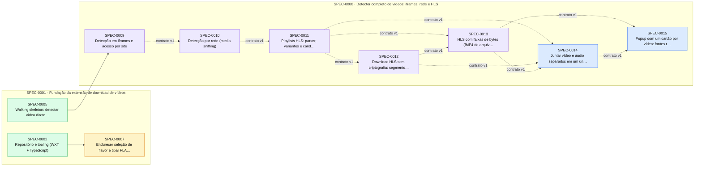

# Índice de Specs

> Gerado por `spec_graph.py index` em 2026-10-02 — não edite manualmente.

## Saúde

- Validação (G0): **0 erro(s), 15 aviso(s)** — rode `spec_graph.py validate`
- Specs: proposed 1, approved 2, in-progress 5, implemented 5
- Impedimentos: **0 aberto(s)**, 7 resolvido(s)

## Cobertura de Pilares

Perfil: **padrao**

| Pilar | Situação | Detalhe |
|---|---|---|
| Arquitetura e fronteiras | coberto | ADR-0001, ADR-0011 |
| Estratégia de testes | coberto | ADR-0002 |
| Qualidade de código | coberto | ADR-0003 |
| Entrega contínua e ambientes | coberto | ADR-0004 |
| Fluxo de mudança | coberto | ADR-0005 |
| Segredos e dados sensíveis | coberto | ADR-0006 |
| Identidade e acesso | coberto | ADR-0007, ADR-0012 |
| Dependências e ciclo de vida da stack | coberto | ADR-0008, ADR-0013 |
| Observabilidade | coberto | ADR-0009 |
| Resiliência e recuperação | dispensado | extensão 100% local, sem servidor nem dados persistentes de valor; retomada/falha de download tratada nas specs de feature |
| Dados e migrações | dispensado | sem banco; só preferências em chrome.storage — migração de schema de preferências coberta por teste na spec que introduzir a primeira mudança |
| Custo | dispensado | sem infraestrutura paga; único custo é a taxa única de US$ 5 do registro de desenvolvedor da Chrome Web Store (reavaliar no épico do Google Drive) |

## Jornadas Críticas

| Jornada | Situação | Specs |
|---|---|---|
| Usuário abre uma página com vídeo sem DRM, vê o vídeo no popup e baixa o arquivo | provada | SPEC-0005 |
| Usuário abre uma página com o player dentro de um iframe de outro domínio e baixa o vídeo | planejada | SPEC-0009 |
| Usuário escolhe a qualidade de um vídeo HLS sem criptografia e baixa um MP4 válido | planejada | SPEC-0012, SPEC-0013, SPEC-0014, SPEC-0015 |

## Plano de Execução

**Em andamento:** SPEC-0009, SPEC-0010, SPEC-0011, SPEC-0012, SPEC-0013  
**Paradas por impedimento:** —  
**Próximo lote:** —

| Onda | Spec | Título | Tier/Tam. | Status | Prontidão | Observação |
|---|---|---|---|---|---|---|
| 1 | SPEC-0009 | Detecção em iframes e acesso por site | full/M | in-progress | 🔄 em andamento |  |
| 2 | SPEC-0010 | Detecção por rede (media sniffing) | full/M | in-progress | 🔄 em andamento | saiu da onda 1: arquivos em comum com SPEC-0009 |
| 3 | SPEC-0011 | Playlists HLS: parser, variantes e candidato no popup | full/M | in-progress | 🔄 em andamento | saiu da onda 1: arquivos em comum com SPEC-0009; saiu da onda 2: arquivos em comum com SPEC-0010 |
| 4 | SPEC-0012 | Download HLS sem criptografia: segmentos, junção em MP4 e progresso | full/M | in-progress | 🔄 em andamento | saiu da onda 1: arquivos em comum com SPEC-0009; saiu da onda 2: arquivos em comum com SPEC-0010; saiu da onda 3: arquivos em comum com SPEC-0011 |
| 5 | SPEC-0013 | HLS com faixas de bytes (fMP4 de arquivo único), popup sem ruído de blob e master vista como arquivo | full/M | in-progress | 🔄 em andamento | saiu da onda 1: arquivos em comum com SPEC-0009; saiu da onda 2: arquivos em comum com SPEC-0010; saiu da onda 3: arquivos em comum com SPEC-0011; saiu da onda 4: arquivos em comum com SPEC-0012 |
| 5 | SPEC-0007 | Endurecer seleção de flavor e tipar FLAVOR | lite/S | proposed | ⏳ aguardando aprovação (H1) | saiu da onda 1: arquivos em comum com SPEC-0009; saiu da onda 2: arquivos em comum com SPEC-0010; saiu da onda 3: arquivos em comum com SPEC-0011; saiu da onda 4: arquivos em comum com SPEC-0012 |
| 6 | SPEC-0014 | Juntar vídeo e áudio separados em um único MP4 | full/M | approved | ✅ pronta | saiu da onda 1: arquivos em comum com SPEC-0009; saiu da onda 2: arquivos em comum com SPEC-0010; saiu da onda 3: arquivos em comum com SPEC-0011; saiu da onda 4: arquivos em comum com SPEC-0012; saiu da onda 5: arquivos em comum com SPEC-0013 |
| 7 | SPEC-0015 | Popup com um cartão por vídeo: fontes redundantes recolhidas e seletor de áudio | full/M | approved | ✅ pronta | saiu da onda 1: arquivos em comum com SPEC-0009; saiu da onda 2: arquivos em comum com SPEC-0010; saiu da onda 3: arquivos em comum com SPEC-0011; saiu da onda 4: arquivos em comum com SPEC-0012; saiu da onda 5: arquivos em comum com SPEC-0013; saiu da onda 6: arquivos em comum com SPEC-0014 |

## Épicos

| Épico | Título | Status | Progresso |
|---|---|---|---|
| SPEC-0001 | Fundação da extensão de download de vídeos | approved | 5/6 implementadas |
| SPEC-0008 | Detector completo de vídeos: iframes, rede e HLS | approved | 0/7 implementadas |

## Grafo de Dependências

Seta contínua: depende da implementação. Seta tracejada: consome contrato.

## Todas as Specs

| ID | Título | Tier | Tipo | Status | Criada | Épico | Depende de | Consome contrato |
|---|---|---|---|---|---|---|---|---|
| [SPEC-0001](SPEC-0001-fundacao-da-extensao-de-download-de-videos.md) | Fundação da extensão de download de vídeos | epic | foundation | approved | 2026-09-30 | — | — | — |
| [SPEC-0002](SPEC-0002-repositorio-e-tooling-wxt-typescript.md) | Repositório e tooling (WXT + TypeScript) | full | foundation | implemented | 2026-09-30 | SPEC-0001 | — | — |
| [SPEC-0003](SPEC-0003-harness-de-testes-unitario-integracao-e2e-com-extensao-carre.md) | Harness de testes (unitário, integração, E2E com extensão carregada, arquitetura) | full | foundation | implemented | 2026-09-30 | SPEC-0001 | SPEC-0002 | — |
| [SPEC-0004](SPEC-0004-pipeline-de-ci-no-github-actions.md) | Pipeline de CI no GitHub Actions | full | foundation | implemented | 2026-09-30 | SPEC-0001 | SPEC-0002 | — |
| [SPEC-0005](SPEC-0005-walking-skeleton-detectar-video-direto-e-baixar-pelo-popup.md) | Walking skeleton: detectar vídeo direto e baixar pelo popup | full | foundation | implemented | 2026-09-30 | SPEC-0001 | SPEC-0003, SPEC-0004 | — |
| [SPEC-0006](SPEC-0006-pipeline-de-release-e-builds-public-local.md) | Pipeline de release e builds public/local | full | foundation | implemented | 2026-09-30 | SPEC-0001 | SPEC-0004 | SPEC-0005@1 |
| [SPEC-0007](SPEC-0007-endurecer-selecao-de-flavor-e-tipar-flavor.md) | Endurecer seleção de flavor e tipar FLAVOR | lite | fix | proposed | 2026-09-30 | SPEC-0001 | SPEC-0002 | — |
| [SPEC-0008](SPEC-0008-detector-completo-de-videos-iframes-rede-e-hls.md) | Detector completo de vídeos: iframes, rede e HLS | epic | feature | approved | 2026-10-02 | — | — | — |
| [SPEC-0009](SPEC-0009-deteccao-em-iframes-e-acesso-por-site.md) | Detecção em iframes e acesso por site | full | feature | in-progress | 2026-10-02 | SPEC-0008 | SPEC-0005 | — |
| [SPEC-0010](SPEC-0010-deteccao-por-rede-media-sniffing.md) | Detecção por rede (media sniffing) | full | feature | in-progress | 2026-10-02 | SPEC-0008 | — | SPEC-0009@1 |
| [SPEC-0011](SPEC-0011-playlists-hls-parser-variantes-e-candidato-no-popup.md) | Playlists HLS: parser, variantes e candidato no popup | full | feature | in-progress | 2026-10-02 | SPEC-0008 | — | SPEC-0010@1 |
| [SPEC-0012](SPEC-0012-download-hls-sem-criptografia-segmentos-juncao-em-mp4-e-prog.md) | Download HLS sem criptografia: segmentos, junção em MP4 e progresso | full | feature | in-progress | 2026-10-02 | SPEC-0008 | — | SPEC-0011@1 |
| [SPEC-0013](SPEC-0013-hls-com-byte-range-e-popup-sem-ruido-de-blob-e-trilhas-separ.md) | HLS com faixas de bytes (fMP4 de arquivo único), popup sem ruído de blob e master vista como arquivo | full | feature | in-progress | 2026-10-02 | SPEC-0008 | — | SPEC-0011@1, SPEC-0012@1 |
| [SPEC-0014](SPEC-0014-juntar-video-e-audio-separados-em-um-unico-mp4.md) | Juntar vídeo e áudio separados em um único MP4 | full | feature | approved | 2026-10-02 | SPEC-0008 | — | SPEC-0011@1, SPEC-0012@1, SPEC-0013@1 |
| [SPEC-0015](SPEC-0015-popup-com-um-cartao-por-video-fontes-redundantes-recolhidas.md) | Popup com um cartão por vídeo: fontes redundantes recolhidas e seletor de áudio | full | feature | approved | 2026-10-02 | SPEC-0008 | — | SPEC-0013@1, SPEC-0014@1 |

## ADRs

| ID | Título | Status | Garantido por (G3) |
|---|---|---|---|
| [ADR-0001](../adr/ADR-0001-arquitetura-e-fronteiras.md) | Arquitetura e fronteiras | accepted | dependency-cruiser (.dependency-cruiser.cjs) no CI — SPEC-0003 |
| [ADR-0002](../adr/ADR-0002-estrategia-de-testes.md) | Estratégia de testes | accepted | comandos test/test_integration/test_e2e do sdd-config no CI — SPEC-0003/SPEC-0004 |
| [ADR-0003](../adr/ADR-0003-qualidade-de-codigo.md) | Qualidade de código | accepted | lint + typecheck + CodeQL no CI — SPEC-0002/SPEC-0004 |
| [ADR-0004](../adr/ADR-0004-entrega-continua-e-ambientes.md) | Entrega contínua e ambientes | accepted | workflow release.yml e deploy_staging/deploy_production do sdd-config — SPEC-0006 |
| [ADR-0005](../adr/ADR-0005-fluxo-de-mudanca.md) | Fluxo de mudança | accepted | ruleset da main + job sdd (pr-check) — SPEC-0002/SPEC-0004 |
| [ADR-0006](../adr/ADR-0006-segredos-e-dados-sensiveis.md) | Segredos e dados sensíveis | accepted | gitleaks em security_scan no CI + teste de ausência de fetch para hosts externos — SPEC-0004/SPEC-0005 |
| [ADR-0007](../adr/ADR-0007-identidade-e-acesso.md) | Identidade e acesso | accepted | teste de integração sobre o manifest.json gerado (sem <all_urls>, sem CSP relaxada) — SPEC-0005/SPEC-0006 |
| [ADR-0008](../adr/ADR-0008-dependencias-e-ciclo-de-vida-da-stack.md) | Dependências e ciclo de vida da stack | accepted | pnpm audit --audit-level=high em security_scan no CI; dependabot.yml — SPEC-0004 |
| [ADR-0009](../adr/ADR-0009-observabilidade.md) | Observabilidade | accepted | teste de integração do logger (ID de correlação, sem URLs completas com query) — SPEC-0005 |
| [ADR-0010](../adr/ADR-0010-stack-da-extensao-typescript-wxt-manifest-v3.md) | Stack da extensão: TypeScript + WXT (Manifest V3) | accepted | typecheck (tsc --noEmit) e build WXT no CI (SPEC-0004); dependency-cruiser (ADR-0001) |
| [ADR-0011](../adr/ADR-0011-providers-por-site-e-builds-public-local.md) | Providers por site e builds public/local | accepted | dependency-cruiser (fronteiras) + teste sobre dist/public que falha se contiver provider local (SPEC-0006:IT-01) |
| [ADR-0012](../adr/ADR-0012-permissoes-por-flavor-acesso-amplo-no-local-por-site-no-publ.md) | Permissões por flavor: acesso amplo no local, por site no público | accepted | teste de integração sobre o manifest.json gerado de cada flavor (SPEC-0009:IT-05) + teste de que o bundle público não declara host_permissions |
| [ADR-0013](../adr/ADR-0013-montagem-de-hls-m3u8-parser-e-mux-js-em-offscreen-document.md) | Montagem de HLS: m3u8-parser e mux.js em offscreen document | accepted | teste de arquitetura: m3u8-parser só em src/core; mux.js só no offscreen (dependency-cruiser); versões fixadas no package.json (ADR-0008) |
| [ADR-0014](../adr/ADR-0014-juncao-de-trilhas-mp4-video-e-audio-com-mediabunny-no-offscr.md) | Junção de trilhas MP4 (vídeo e áudio) com Mediabunny no offscreen | proposed | teste de arquitetura: mediabunny só em entrypoints/offscreen (dependency-cruiser); versão fixada no package.json (ADR-0008); testes de build de licença (SPEC-0014:UT-06/UT-07); prova de conceito da SPEC-0014 (fase 1) com ffprobe |
